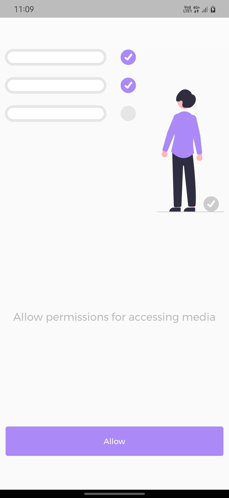
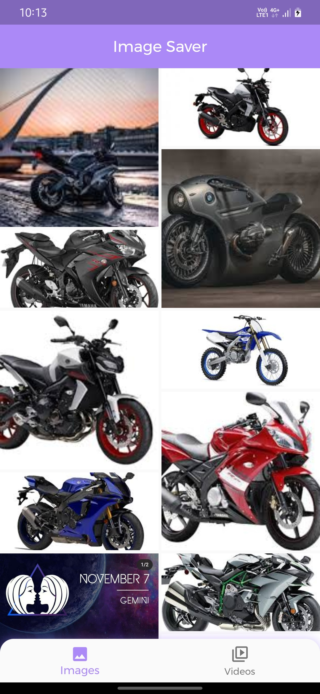
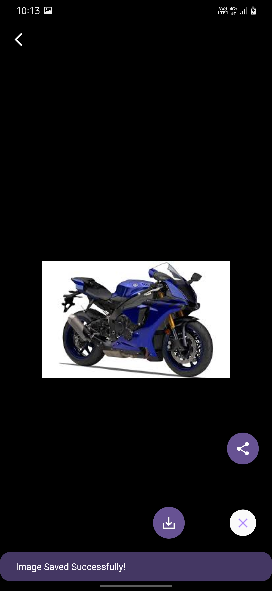
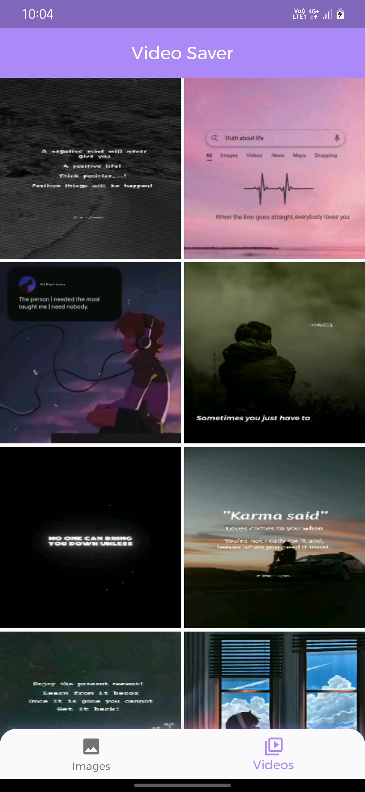
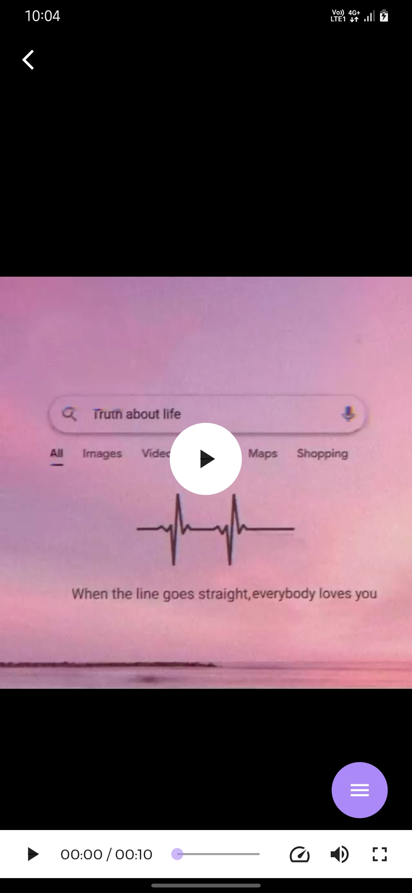

# Flutter_whatsapp_saver

+ Version : 1.0
+ Author : Thirumurugan
+ Created : 2021

Description
-----------
An Android application is used for saving whatsapp status

## Packages

| Package Name | Version | Description |
| :---: | :---: | :---: |
|[permission_handler](https://pub.dev/packages/permission_handler)|1.0.2|For Permissions|
|[flutter_staggered_grid_view](https://pub.dev/packages/flutter_staggered_grid_view)|0.4.1|For Grid view|
|[flutter_svg](https://pub.dev/packages/flutter_svg)|0.23.0+1|For Displaying Svg Images|
|[provider](https://pub.dev/packages/provider)|6.0.1|For Statemanagement|
|[path_provider](https://pub.dev/packages/path_provider)|2.0.6|For Path operations|
|[image_gallery_saver](https://pub.dev/packages/image_gallery_saver)|1.7.1|For Saving Videos and Images to gallery|
|[google_fonts](https://pub.dev/packages/google_fonts)|2.1.0|For Online Fonts|
|[sizer](https://pub.dev/packages/sizer)|2.0.15|For Adaptive UI|
|[video_thumbnail](https://pub.dev/packages/video_thumbnail)|0.4.3|For Generating thumbnails for videos|
|[chewie](https://pub.dev/packages/chewie)|Recent version supported by other packages|For Playing videos|
|[share_plus](https://pub.dev/packages/share_plus)|3.0.4|For Sharing the files|

### Released App 
+ Path: <a href="Apk\App_Release.apk">Click here</a>

## Screenshots
 + **Permission Page 👇🏻**
  
 
  + **Image Saver Page 👇🏻**
  
  
  + **Image viewer Page 👇🏻**
  
 
  + **Video Saver Page 👇🏻**
  
 
  + **Video Viewer Page 👇🏻**
  
 
